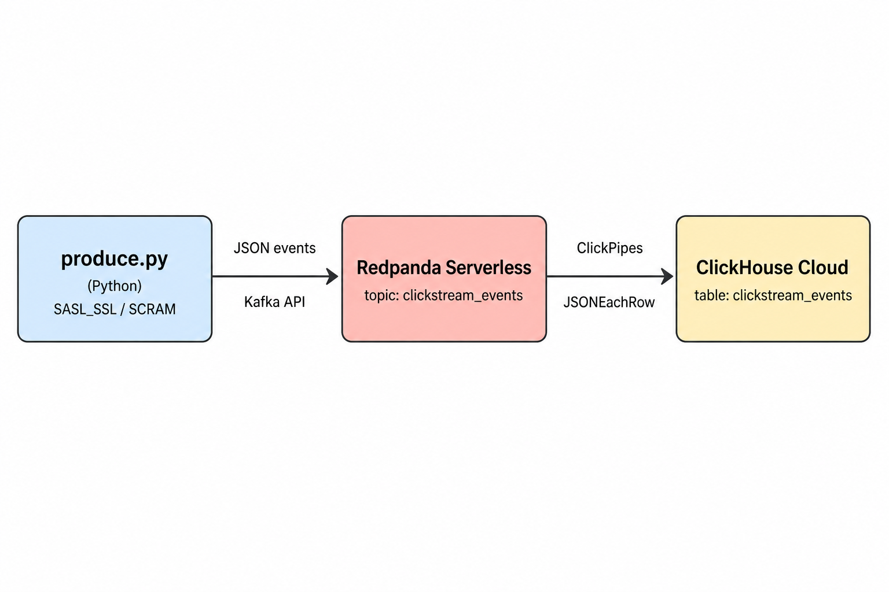

# Redpanda → ClickHouse Cloud demo (ClickPipes)

A small, end-to-end demo that streams synthetic **clickstream events** into a
**Redpanda Serverless** topic and ingests them into **ClickHouse Cloud** using
**ClickPipes**, ClickHouse's managed Kafka ingestion service.



Because Redpanda Serverless is publicly reachable, ClickPipes can connect to it
directly, with no tunnels or self-hosted connector.

## Repository layout

| Path | What it is |
|------|------------|
| `producer/produce.py` | Python producer → Redpanda (SASL_SSL / SCRAM-SHA-256) |
| `producer/events.py` | Synthetic clickstream event generator |
| `clickhouse/01_schema.sql` | Destination table DDL (run before ClickPipes) |
| `clickhouse/02_verify.sql` | Queries to confirm data is flowing |
| `clickhouse/03_showcase.sql` | Example queries demonstrating ClickHouse features |
| `clickpipes/README.md` | ClickPipes setup: UI, `clickhousectl`, or Terraform |
| `clickpipes/terraform/` | Optional: create the ClickPipe as code |
| `scripts/setup_topic.sh` | Create the Redpanda topic with `rpk` |
| `scripts/setup_topic.py` | Create the Redpanda topic without `rpk` (Python) |
| `scripts/backfill.sh` | Bulk-load history (event_time spread over days) |
| `scripts/live.sh` | Stream events in real time during the demo |
| `.env.example` | Connection settings template |

## Prerequisites

- A **Redpanda Cloud** account. The [Serverless free trial](https://www.redpanda.com/try-redpanda)
  gives $100 of credit for 30 days, with no credit card required.
- A **ClickHouse Cloud** service ([free trial](https://clickhouse.com/cloud)).
- **Python 3.9+** (check with `python3 --version`). On macOS/Homebrew use
  `python3`; plain `python` only exists once a virtualenv is activated. On
  Python 3.14 you need `confluent-kafka >= 2.14` for a prebuilt wheel (already
  pinned in `producer/requirements.txt`).
- Optional: [`clickhousectl`](https://clickhouse.com/cli) to provision the
  service, apply the schema, and create the ClickPipe from the CLI (used in
  Steps 4-5). Service/pipe creation needs API key auth, not OAuth login.
- Optional: [`rpk`](https://docs.redpanda.com/current/get-started/rpk-install/)
  to create the topic from the CLI. If you do not have it, use the Python
  fallback in Step 3.

## Step 1: Create the Redpanda Serverless cluster

1. Sign up / log in to [Redpanda Cloud](https://cloud.redpanda.com/).
2. Create a **Serverless** cluster (provisions in seconds).
3. Under **Security → Users**, create a user (SCRAM-SHA-256). Note the username
   and password.
4. From the cluster's **Kafka API** / overview page, copy the **bootstrap
   server** (host:port).

## Step 2: Configure local settings

```bash
cp .env.example .env
# Edit .env: REDPANDA_BROKERS, REDPANDA_USERNAME, REDPANDA_PASSWORD
```

## Step 3: Create the topic

Via the Redpanda Console UI (topic name `clickstream_events`), or with `rpk`:

```bash
./scripts/setup_topic.sh
```

No `rpk`? Use the Python fallback (no extra install beyond the producer venv from
Step 6, which uses `confluent-kafka`):

```bash
producer/.venv/bin/python scripts/setup_topic.py
```

## Step 4: Create the ClickHouse table

Run the contents of [`clickhouse/01_schema.sql`](clickhouse/01_schema.sql) in
your ClickHouse Cloud **SQL console**.

Or do it from the CLI with `clickhousectl`. Mutating operations need API key auth
(OAuth login is read-only), so log in with a key first:

```bash
clickhousectl cloud auth login --api-key <KEY_ID> --api-secret <KEY_SECRET>

# Optional: create a service (skip if you already have one)
clickhousectl cloud service create --name redpanda-demo --provider aws --region eu-central-1

# Apply the schema (find <SERVICE_ID> via `clickhousectl cloud service list`)
clickhousectl cloud service query --id <SERVICE_ID> --queries-file clickhouse/01_schema.sql
```

`service create` prints the service's default-user password once — save it.

## Step 5: Create the ClickPipe

Follow [`clickpipes/README.md`](clickpipes/README.md), which covers three paths:
the **UI** (easiest for a first demo), **`clickhousectl`**, and **Terraform**.

UI quick path: Data sources → Apache Kafka → Redpanda → enter broker + SCRAM
credentials → topic `clickstream_events` → format `JSONEachRow` → existing table
`default.clickstream_events`.

CLI quick path (see `clickpipes/README.md` for the full command, including the
required `--column` mappings):

```bash
clickhousectl cloud clickpipe create kafka <SERVICE_ID> --name redpanda-clickstream-demo \
  --kafka-type redpanda --brokers "$REDPANDA_BROKERS" --topics "$REDPANDA_TOPIC" \
  --format JSONEachRow --auth SCRAM-SHA-256 --username "$REDPANDA_USERNAME" \
  --password "$REDPANDA_PASSWORD" --offset from_beginning \
  --database default --table clickstream_events --column "event_id:UUID" # ...and the rest
```

## Step 6: Produce events

```bash
cd producer
python3 -m venv .venv && source .venv/bin/activate
# inside the venv, `python` now works and points at your venv interpreter
pip install -r requirements.txt
```

There are two modes, each with a convenience script.

**Backfill** (run ahead of the demo to build up a sizable dataset). Spreads
`event_time` across the last 7 days so the data spans a realistic time range:

```bash
./scripts/backfill.sh
```

Defaults to 5,000,000 events at ~20k/s, which lands in roughly 5-10 minutes. Even
spread over 7 days, that leaves ~30k events in any given hour, so the
time-windowed queries still have plenty to show. Override via env vars, e.g.
`COUNT=10000000 BACKFILL_DAYS=14 ./scripts/backfill.sh`.

**Live** (run during the demo so rows land in real time). Events are stamped at
the current time; runs until you press Ctrl-C:

```bash
./scripts/live.sh
```

Defaults to unlimited events at ~500/s. Override with e.g. `RATE=2000 ./scripts/live.sh`.

Both scripts use `producer/.venv` if present, otherwise `python3`, and pass any
extra flags through to `produce.py`.

## Step 7: Verify in ClickHouse

Run queries from [`clickhouse/02_verify.sql`](clickhouse/02_verify.sql). For
example:

```sql
SELECT count(), max(event_time) FROM default.clickstream_events;
```

Watch the count climb as ClickPipes ingests the stream end to end.

Then run [`clickhouse/03_showcase.sql`](clickhouse/03_showcase.sql) to see more
ClickHouse features: funnels, retention, approximate distinct counts, quantiles,
window functions, gap-free time series, and a real-time materialized view.

## Cleanup

- Delete the ClickPipe (UI, `terraform destroy`, or `clickhousectl`).
- `DROP TABLE default.clickstream_events;`
- Delete the Redpanda topic / cluster to stop consuming trial credits.
